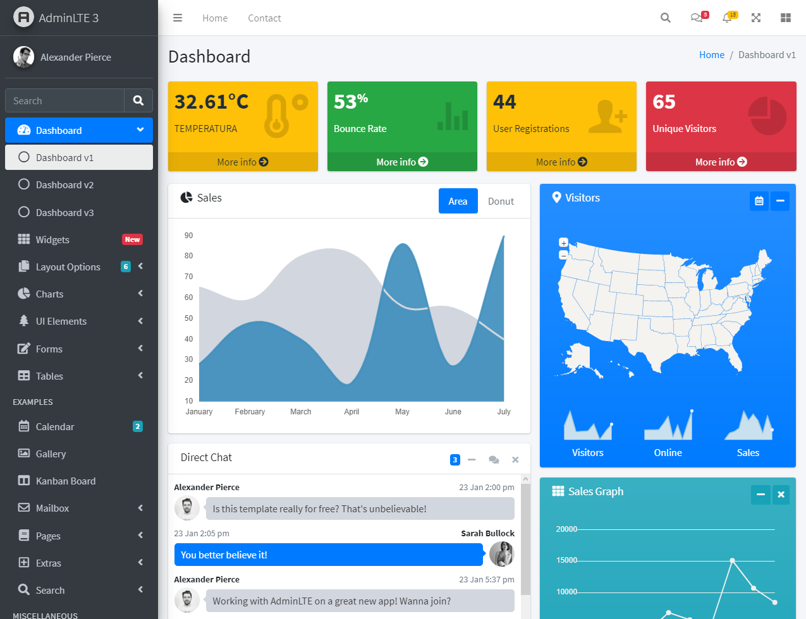

# Seminario Web - Estación de Monitoreo de Datos con Python

Alan Badillo Salas (dragonnomada123@gmail.com)

## Bienvenida

En este seminario web gratuito aprendimos a construir una estación de monitoreo de datos, que nos permite consumir nuestros datos generados en Python desde cualquier lugar. Además aprendimos a crear un dashboard con gráficas y reportes para impactar a nuestra audiencia. No necesitamos saber a programar ya que Python es un lenguaje muy sencillo de aprender.

## Mira el código que construimos juntos

En https://github.com/dragonnomada/webinar-python-monitor se encuentra todo el código generado.

## Próximos Seminarios Web Gratuitos

`Jueves 25 de marzo de 2021 7pm México` - **La magia de GraphQL y la nueva era del API (repetición para KMMX)**

Míralo en https://www.youtube.com/watch?v=2EV6Np0b9Ps

`Míercoles 31 de marzo de 2021 8pm México` - **Diseño de Productos Digitales - El UI/UX y Product Thinking a detalle**

`Miércoles 7 de abril de 2021 8pm México` - **Socket IO - Comunicación en tiempo real y Streaming con APIs vivas**

`Miércoles 13 de abril de 2021 8pm México` - **Cómputo en la nube con Azure Functions - Crear un API potente en segundos sin infraestructura**

## Sígueme en Twitter y entérate de más seminarios gratuitos

> Twitter https://twitter.com/dragonnomada123 `@dragonnomada123`

Aquí publico noticias sobre nuevos artículos en mi canal de medium y nuevos vídeos en mi canal de youtube.

> Instagram https://www.instagram.com/nomadacode/ `@nomadacode`

Aquí encontrarás información de mi proyecto llamado **Nomada Code** si te interesa aprender con infogramas las tecnologías y quieres ser parte de la comunidad y llegar a ser un #AquitectoDeSoftware.

> Youtube https://www.youtube.com/channel/UC4BQEIjIKQnCEvR3iGer37A

Aquí encontrarás videos cortos como cápsulas y todos los seminarios web gratuitos por si te los perdiste.

> LinkedIn https://www.linkedin.com/in/badillosoft

Aquí podrás verme en la red de empleados y empleadores, por si te interesa colaborar en algún proyecto o contratar un curso de calidad profesional.

> Medium https://dragonnomada.medium.com

Aquí podrás ver mis artículos sobre programación avanzada, diseño y filosofía Zen.

> Gmail dragonnomada123@gmail.com

Finalmente, no olvides mandarme un video si tienes dudas o deseas contactar un curso, micro-curso, asesorías o consultorías. **Podemos elevar el nivel de tu equipo de desarrollo y preparárlo para las grandes ligas en proyectos de calidad internacional**.

## ¡Muchas Gracias!

Tu asistencia fue muy valiosa y contribuye a que siga teniendo ese ánimo y energía de acercar el conocimiento a cualquier persona. Por lo que te pido que me sigas en twitter y te suscribas. Pronto comenzaré a regalar horas consultoría a emprendedores para encaminar sus proyectos y potencias sus habilidades.

## Resumen

Aquí te dejo un resumen del seminario web, espero que te sirva para completar el proyecto y darle la calidad profesional que están buscando los gobiernos, para poder implementar ciudades inteligentes.

En este seminario aprendimos:

1. Montar un Servidor de Datos
2. Construir un API de Datos
3. Crear una Interfaz
4. Consumir el API en la Interfaz
5. Crear un Dashboard
6. Generar una Gráfica
7. Generar un Reporte

## Presentación

Puedes consultar la presentación en https://slides.com/dragonnomada123/python-monitor

## Así quedó nuestro dashboard



## Así montamos el servidor

> app.py

``` py
from flask import Flask, render_template

app = Flask(__name__)

@app.route("/")
def home():
    return "<h1>Estación de Monitoreo de Datos</h1>"

app.run()
```

## Así definimos el API de datos

``` py
# /api/sensor/temperatura
# /api/sensor/humedad
# /api/sensor/123
# /api/sensor/...
@app.route("/api/sensor/<id>")
def sensor(id):
    from random import uniform

    celcius = uniform(0, 90)

    # TODO: Recupera los datos del sensor <id>
    return {
        "celcius": celcius,
        "faren": 9 / 5. * celcius + 32,
        "label": "Normal" if celcius < 30 else "Alta",
        "color": "success" if celcius < 30 else "danger"
    }
```

## Así creamos nuestra interfaz

> templates/sensor-dep.html

``` html
<span id="temp-celcius" class="badge bg-primary">60°C</span>
<span id="temp-faren" class="badge bg-secondary">128°F</span>
<span id="temp-label" class="badge bg-success">Normal</span>
```

## Así consumimos el servidor cada sengundo

> templates/sensor-dep.html

``` js
setInterval(async () => {
    const response = await fetch("/api/sensor/temperatura");

    const data = await response.json();

    console.log(data);

    const tempCelcius = document.getElementById("temp-celcius");
    tempCelcius.textContent = `${data.celcius.toFixed(2)}°C`;

    const tempFaren = document.getElementById("temp-faren");
    tempFaren.textContent = `${data.faren.toFixed(2)}°F`;

    const tempLabel = document.getElementById("temp-label");
    tempLabel.textContent = `Estado: ${data.label}`;

    tempLabel.classList.remove("bg-success");
    tempLabel.classList.remove("bg-danger");
    tempLabel.classList.add(`bg-${data.color}`);
}, 1000);
```

## Así montamos la vista

> app.py

``` py
@app.route("/view/sensor/<id>")
def sensor_view(id):
    return render_template("sensor.html")
```

### Así cargamos el dashboard

> templates/sensor.html

``` html



<div class="small-box bg-warning">
    <div class="inner">
        <h3 id="temp-celcius">0 °C</h3>

        <p>TEMPERATURA</p>
    </div>
    <div class="icon">
        <i class="fas fa-temperature-low"></i>
    </div>
    <a href="javascript:void(0)" class="small-box-footer" onclick="showTemp()">More info <i class="fas fa-arrow-circle-right"></i></a>
</div>

<script>
    let lastData = {};

    function showTemp() {
        alert(`La temperatura es ${lastData.celcius}`);
    }

    setInterval(async () => {
        const rensponse = await fetch("/api/sensor/temperatura");

        const data = await rensponse.json();

        lastData = data;

        const tempCelcius = document.getElementById("temp-celcius");

        tempCelcius.textContent = `${data.celcius.toFixed(2)}°C`;
    }, 5000);
</script>

```

## Así generamos una gráfica dinámica con Matplotlib

> app.py

``` py
import matplotlib.pyplot as plt
from io import BytesIO
import base64
import numpy as np

@app.route("/graphics/sensor/<id>")
def sensor_plot(id):
    fig = plt.Figure()
    ax = fig.subplots()
    x = np.linspace(0, 10, 20)
    y = np.sin(x) + np.random.uniform(-1, 1, 20) * 5
    ax.plot(x, y, "r+-")
    buf = BytesIO()
    fig.savefig(buf, format="png")
    data = base64.b64encode(buf.getbuffer()).decode("ascii")
    return f""
```

## Así generamos un documento PDF con PDFKit

> app.py

``` py
from flask import make_response
import pdfkit 
 
@app.route("/pdf/sensor/<id>")
def sensor_pdf(id):
    html = render_template(
        "sensor_pdf.html",
        celcius=60.5)
    pdf = pdfkit.from_string(html, False)
    response = make_response(pdf)
    response.headers["Content-Type"] = "application/pdf"
    response.headers["Content-Disposition"] = "inline; filename=output.pdf"
    return response
```

# ...

## Documentación

> Documentación oficial de flask

https://flask.palletsprojects.com/en/1.1.x/

> Uso de templates

https://flask.palletsprojects.com/en/1.1.x/tutorial/templates/

> Documentación oficial de los templates de Jinja

https://jinja.palletsprojects.com/en/2.11.x/templates/

> Bootstrap - Diseño rápido y de buena calidad

https://getbootstrap.com

> Plantilla de Dashboard gratuita

https://adminlte.io

> Descargar la plantilla

https://github.com/ColorlibHQ/AdminLTE/releases/tag/v3.1.0

> Devolver una Gráfica de Matplolib con Flask

https://matplotlib.org/devdocs/gallery/user_interfaces/web_application_server_sgskip.html

> Crear un PDF desde una plantilla HTML con Flask

https://pythonprogramming.altervista.org/make-a-pdf-from-html-with-python-and-flask/

> Íconos de temperatura para el Dashboard con Fontawesome

https://fontawesome.com/icons?d=gallery&p=2&q=temp

> Plotly - Graficación profesional

https://plotly.com

> Socket IO - Comunicación en tiempo real (API viva)

https://socket.io
